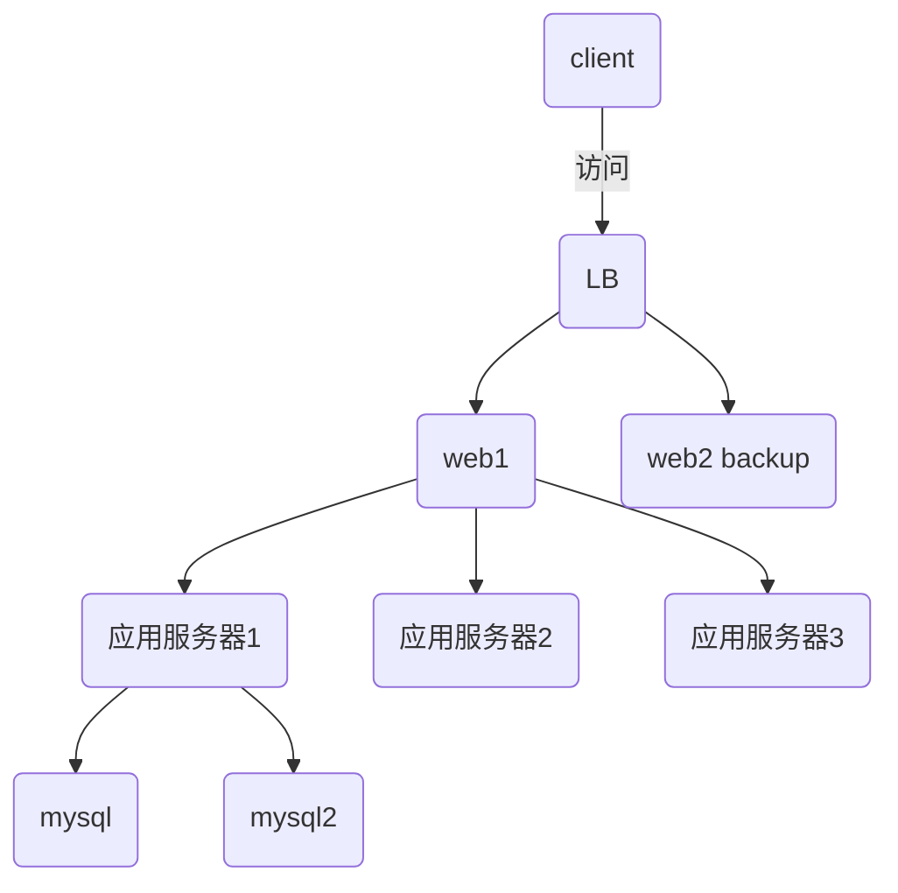
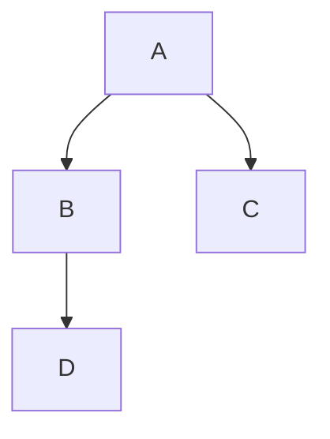

## Mermaid 順序圖 與FLOW流程圖示範案例






```flow

st=>start: 开始框
 
op=>operation: 处理框
 
cond=>condition: 判断框(是或否?)
 
sub1=>subroutine: 子流程
 
io=>inputoutput: 输入输出框
 
e=>end: 结束框
 
st->op->cond
 
cond(yes)->io->e
 
cond(no)->sub1(right)->op

```

```flow
st=>start: 開始
op1=>operation: 打開保險套 
cond1=>condition: 硬了沒
cond2=>condition: 濕了沒
sub1=>subroutine: 打手槍
sub2=>subroutine: 摳BB
op2=>operation: 抽插
io=>inputoutput: 射出來
e=>end: 结束穿衣服
st->op1->cond1
cond1(yes)->cond2(yes)->op2->io->e
cond1(no)->sub1(right)->cond1
cond2(no)->sub2(right)->cond2
```

