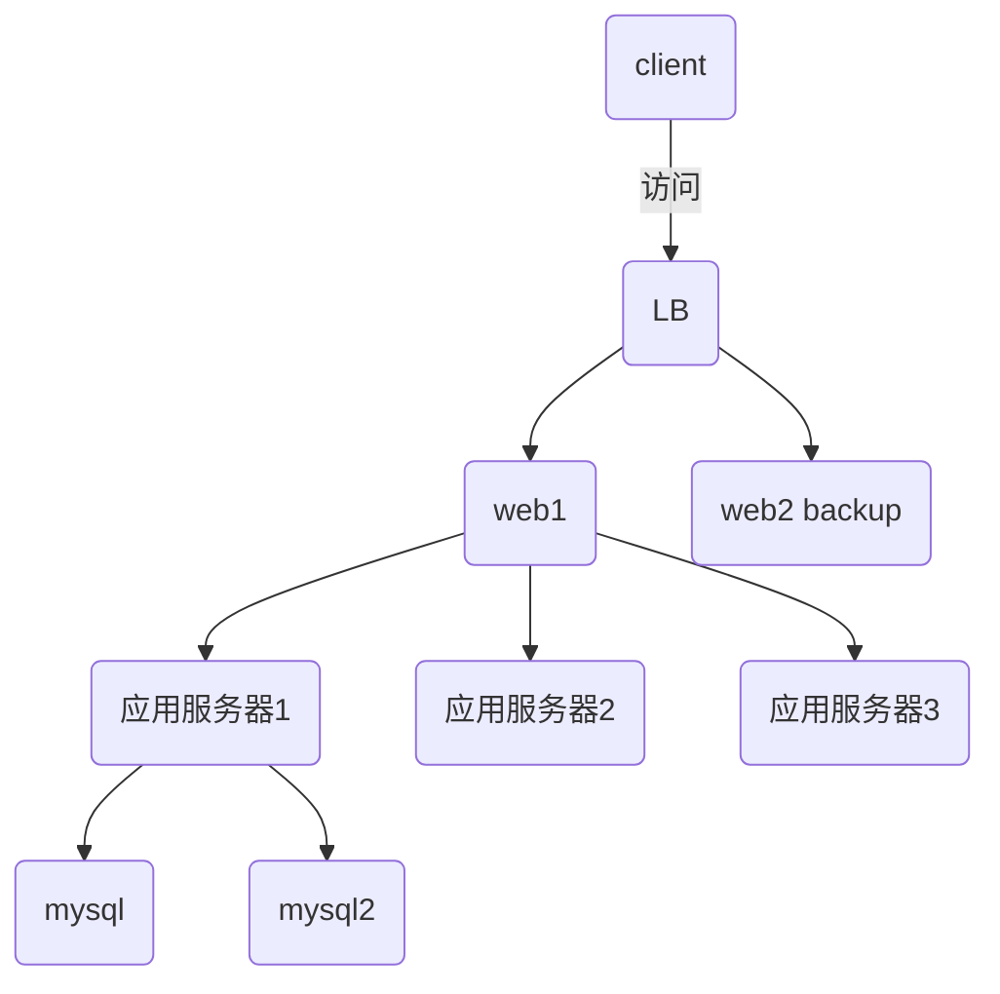
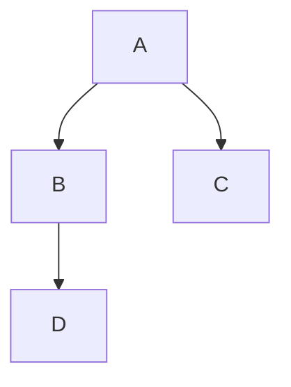

# mermaid語法


```mermaid
graph TD
1(client)-->|访问|2(LB)
2-->3(web1)
2-->4(web2 backup)
3-->5(应用服务器1)
3-->6(应用服务器2)
3-->7(应用服务器3)
5-->9(mysql)
5-->10(mysql2)
```

如何使用 輸入**```mermaid**   

## 語法


## 範例:



```mermaid
graph TD
A-->B
A-->C
B-->D
```

